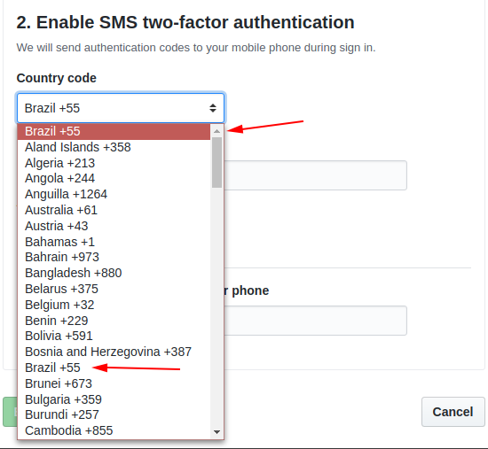

# GitHub's Two-Factor Authentication for Brazil

## Description

GitHub does not have a Brazil option within the selected countries when configuring 2FA (Two-Factor Authentication). So you cannot set up the 2FA when your number comes from Brazil. The next step will make this possible. 

## How to

- On [GitHub - Settings - Security](https://github.com/settings/security) section, click in `Enable 2FA`
- Copy and paste the following code in the browser console DevTools (pressing F12 or CTRL + SHIFT + I):

```js
const countryCodes = document.querySelector('#countrycode');
const [...options] = countryCodes.options;

countryCodes.innerHTML = '<option value="+55">Brazil +55</option>';
options
	.slice(1, options.length)
	.map(({ innerHTML, value }) => ({ innerHTML, value }))
	.concat({ innerHTML: 'Brazil +55', value: '+55' })
	.sort(({ innerHTML }, { innerHTML: nextInnerHTML }) => innerHTML.localeCompare(nextInnerHTML))
	.map(({ innerHTML, value }) => Object.assign(document.createElement('option'), { innerHTML, value }))
	.forEach(option => countryCodes.appendChild(option));
```

See the code in the Gist: [Click here](https://gist.github.com/lucasgdb/3ee5dff4a4d2447fa40d7a2c0660a161)

And then this will be possible:



## Author

| [<br><sub>@lucasgdb</sub>](https://github.com/lucasgdb) |
| :----------------------------------------------------------------------------------------------------------------------------: |
